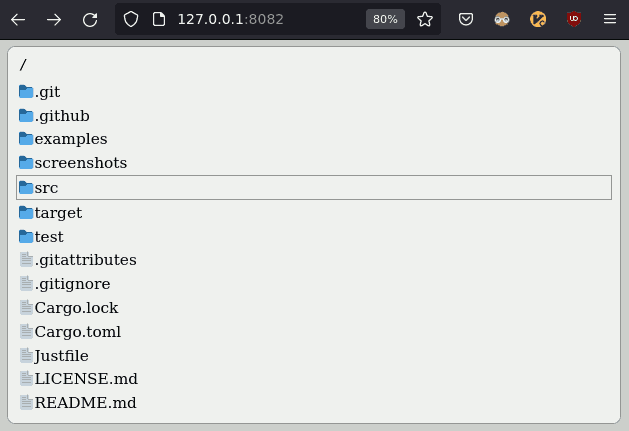

# Warpy



A thin warp wrapper for serving folders over http. 

## Why?

Single contained lib with minimalistic CSS style to add http serving of a folder to any application.

## Usage

The package is a library, add it to your `Cargo.toml` dependencies as you would any other package.

## Example

To run a simple example serving from the folder it is invoked, try:

```bash
cargo run --example simple
```